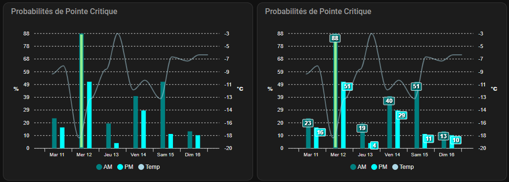
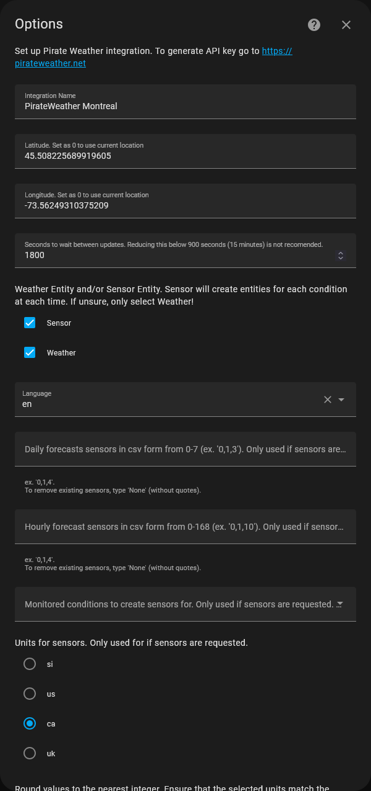

# Configuration : Prédiction des Pointes Critiques (ApexCharts & Sensors)

Ce document détaille la configuration modifiée pour visualiser les probabilités de pointes critiques (Hydro-Québec) avec l'intégration de la température et une interface optimisée.

Ceci est le fruit du travail de plusieurs membres sur le dicord 
  * JoRouss
  * VerbalP
  * @mdallaire
  * MivraMe
  * FrancoLoco

## 📋 Résumé des modifications

### Ajouts
* **Température Montréal :** Ajoutée pour alimenter l'algorithme de prédiction.

### Modifications
* **Optimisation des séries :** Génération de **3 séries** au lieu de 14 pour alléger le code et simplifier la légende.
* **Axe X personnalisé :** Affichage des jours de la semaine.

### Options d'affichage
* **DataLabels :** Activés pour une lecture directe des valeurs.
* **Seuil visuel (Threshold) :** La barre devient **verte** lorsque la probabilité dépasse un certain seuil (ex: 70%).

<div align="center">
  
</div>

---

## 🛠️ Installation et Configuration

### Étape 1 : Installez et configurez Pirate Weather

**Nom suggéré :** PirateWeather Montreal
**Emplacement :** `45.508225689919605`, `-73.56249310375209`

**Configuration :**
Configurez l'intégration selon les paramètres recommandés ci-dessous :

* **Integration Name :** PirateWeather Montreal
* **Latitude :** 45.508225689919605
* **Longitude :** -73.56249310375209
* **Seconds to wait between updates :** 1800
* **Weather Entity :** ✅ Coché
* **Sensor Entity :** ✅ Coché
* **Language :** en
* **Units :** ca

<div align="center">
  
</div>

### Étape 2 : Configuration des Sensors (YAML)

Ajoutez le code suivant dans la section `template:` de votre fichier `configuration.yaml` (ou `templates.yaml` selon votre structure).

<details>
<summary><b>🔻 Cliquez pour afficher le code YAML des Sensors</b></summary>

```yaml
# configuration.yaml (Section template)

- trigger:
    - trigger: time_pattern
      minutes: /5 
  action:
    - action: weather.get_forecasts
      data:
        type: hourly
      target:
        entity_id: weather.pirateweather_montreal
      response_variable: hourly
  sensor:
      - name: Weather Forecast Montreal Hourly
        unique_id: weather_forecast_montreal_hourly
        icon: mdi:weather-cloudy
        state: "{{ hourly['weather.pirateweather_montreal'].forecast[0].condition }}"
        attributes:
          forecast: "{{ hourly['weather.pirateweather_montreal'].forecast }}"

- sensor:
  - name: "Hydro Peak Probability"
    unique_id: hydro_peak_probability
    unit_of_measurement: "%"
    state: >
      
      
      
      
      

      
      
      
      {{ (e**(-4.40982668173898+-0.347977050508489*temp)/(1+e**(-4.40982668173898+-0.347977050508489*temp)) *100) |round(2)  }}
    attributes:
      predictions: >
        
        
        
        
        
        

        
          
          
          
          
          
          
          

          
          
          
          
          
          

        
        
        {{ data.predictionslist }}
```
</details>

### Étape 3 : Configuration du Dashboard (Lovelace)

Ajoutez une carte `custom:apexcharts-card` à votre tableau de bord avec la configuration suivante.

<details>
<summary><b>🔻 Cliquez pour afficher le code de la carte ApexCharts</b></summary>

```yaml
type: custom:apexcharts-card
header:
  show: true
  title: Probabilités de Pointe Critique
graph_span: 6d
span:
  start: day
  offset: +1d
color_list:
  - teal
  - cyan
  - lightblue
apex_config:
  legend:
    onItemClick:
      toggleDataSeries: false
    onItemHover:
      highlightDataSeries: false
  markers:
    size: 0
  tooltip:
    enabled: false
  chart:
    height: auto
  dataLabels:
    dropShadow:
      enabled: true
      opacity: 0.8
  plotOptions:
    bar:
      columnWidth: 100%
      colors:
        ranges:
          - from: 70
            to: 100
            color: lightgreen
  stroke:
    width: 2
  xaxis:
    type: numeric
    tickAmount: 6
    tooltip:
      enabled: false
    axisTicks:
      show: true
      offsetY: 0
      offsetX: -1
      height: 7
    labels:
      show: true
      trim: true
      rotate: -45
      rotateAlways: false
      offsetX: 8
      offsetY: -4
      style:
        fontSize: 10px
      formatter: |
        EVAL:function(value, timestamp) {
          var daysOfWeek = ['Dim', 'Lun', 'Mar', 'Mer', 'Jeu', 'Ven', 'Sam'];
          var date = new Date(timestamp);

          var diff = date - Date.now();
          let diffDays = Math.floor(diff / (1000 * 3600 * 24));

          return diffDays >= 6 ? '' : `${daysOfWeek[date.getDay()]} ${date.getDate()}`;
        }
yaxis:
  - id: first
    min: 0
    max: ~80
    decimals: 0
    apex_config:
      title:
        text: "%"
        rotate: 0
  - id: second
    min: ~-20
    max: ~-10
    opposite: true
    decimals: 0
    apex_config:
      title:
        text: °C
        rotate: 0
series:
  - entity: sensor.hydro_peak_probability
    name: AM
    type: column
    unit: "%"
    yaxis_id: first
    show:
      legend_value: false
      datalabels: false
    time_delta: +4h
    data_generator: |
      const data = [];
      for(let i = 0; i < 12; i++) {
        if (entity.attributes.predictions[i].peak != 'AM')
          continue;

        var date = new Date(entity.attributes.predictions[i].datetime);
        data.push([date, entity.attributes.predictions[i].critical])
      }
      return data;
  - entity: sensor.hydro_peak_probability
    name: PM
    type: column
    unit: "%"
    yaxis_id: first
    show:
      legend_value: false
      datalabels: false
    time_delta: "-3h"
    data_generator: |
      const data = [];
      for(let i = 0; i < 12; i++) {
        if (entity.attributes.predictions[i].peak != 'PM')
          continue;

        var date = new Date(entity.attributes.predictions[i].datetime);
        data.push([date, entity.attributes.predictions[i].critical])
      }
      return data;
  - entity: sensor.hydro_peak_probability
    name: Temp
    type: line
    unit: °C
    opacity: 0.5
    yaxis_id: second
    show:
      legend_value: false
      datalabels: false
    data_generator: |
      const data = [];
      for(let i = 0; i < 12; i++) {

        var date = new Date(entity.attributes.predictions[i].datetime);
        data.push([date, entity.attributes.predictions[i].temp])
      }
      return data;
```
</details>